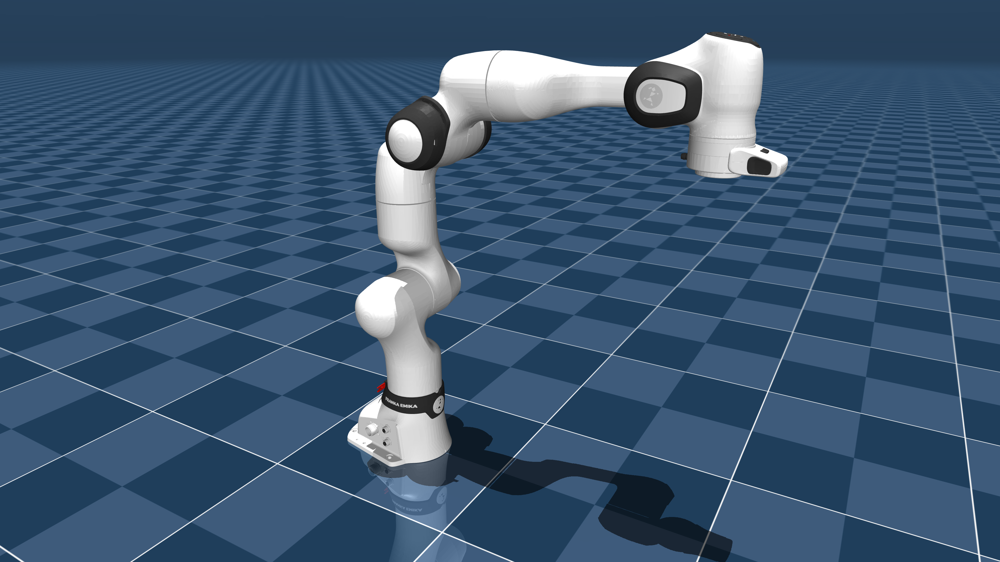
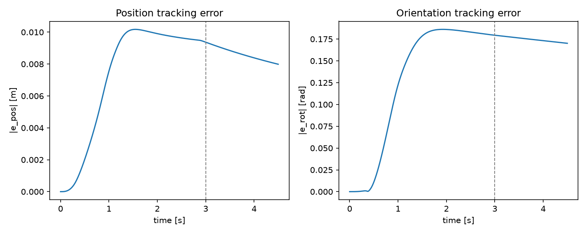
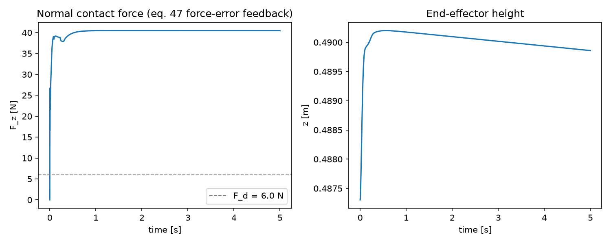

# Operational-Space Control on a MuJoCo Franka FR3


<p align="center">
  
</p>

A from-scratch implementation of

> O. Khatib, *A Unified Approach for Motion and Force Control of Robot
> Manipulators: The Operational Space Formulation*, IEEE Journal of Robotics
> and Automation, RA-3(1), Feb. 1987.

for a 6-DOF, torque-actuated Franka FR3 in MuJoCo: the end-effector dynamics
(eq. 14-25), the unconstrained-motion control law (eq. 28-31, 34), and the
hybrid motion/force control law with generalized task-specification matrices
(eq. 1-4, 45-48).

"From scratch" means the *control law itself* — Lambda(x), mu(x,xdot), p(x),
the task-specification matrices, the motion and hybrid torque commands — is
derived and coded directly from the paper's numbered equations, not pulled
from an existing OSC library. Joint-space dynamics (mass matrix, bias forces,
Jacobians) come from MuJoCo's own rigid-body engine — see
[Design notes](#design-notes-what-from-scratch-means-here).

## Contents

- [Scope](#scope)
- [Quick start](#quick-start)
- [Results](#results)
- [Why the FR3 is reduced to 6 DOF](#why-the-fr3-is-reduced-to-6-dof)
- [Design notes: what "from scratch" means here](#design-notes-what-from-scratch-means-here)
- [Where the equations live](#where-the-equations-live)
- [Design choices made explicitly](#design-choices-made-explicitly-per-user-direction)
- [Limitations (honest deviations)](#limitations-honest-deviations)
- [Layout](#layout)
- [License](#license)

## Scope

In scope: unconstrained operational-space motion control (Sec. III-IV) and
hybrid motion/force control (Sec. II, V). Out of scope: redundant-manipulator
null-space control (Sec. VI-VII) and singularity-robust control (Sec. VIII)
— see [Why the FR3 is reduced to 6 DOF](#why-the-fr3-is-reduced-to-6-dof) for
how that shaped the model.

## Quick start

Requires [uv](https://docs.astral.sh/uv/) and Python 3.11+.

```bash
cd "paper implementation/khatib_osc_fr3"
uv sync --extra dev

# (re)generate the derived MJCF from the vendored Menagerie franka_fr3 model
uv run python scripts/build_model.py

uv run pytest tests/ -v

uv run python scripts/demo_motion.py    # -> results/motion_*.png, motion_demo.mp4
uv run python scripts/demo_hybrid.py    # -> results/hybrid_*.png, hybrid_demo.mp4

# interactive viewer (needs a display)
uv run python -c "
import mujoco, mujoco.viewer
from khatib_osc.robot import load_robot
r = load_robot()
mujoco.viewer.launch(r.model, r.data)
"
```

## Results

**Unconstrained motion control** (`scripts/demo_motion.py`) — minimum-jerk
Cartesian pose trajectory tracked via eq. (28-31, 34):

<p align="center">
  
</p>

**Hybrid motion/force control** (`scripts/demo_hybrid.py`) — position/orientation
held while regulating normal contact force against a table via eq. (45-48):

<p align="center">
  
</p>

Rendered MP4s of both demos are in [`results/`](results/)
(`motion_demo.mp4`, `hybrid_demo.mp4`). See
[Limitations](#limitations-honest-deviations) below for why the orientation
channel and force tracking settle to nonzero residuals rather than exactly
zero — both are explained and quantified, not swept under the rug.

## Why the FR3 is reduced to 6 DOF

Sections III-V derive the end-effector equations of motion assuming the
manipulator is *not* redundant (eq. 9-10: m0 = n). FR3 has 7 joints.
Rather than leave the 7th joint's null-space motion uncontrolled (which
Sec. VI-VII's dynamically-consistent null-space treatment would fix, but is
explicitly out of scope), `scripts/build_model.py` welds joint 4 (the
elbow) at a fixed angle by folding its rotation into the static body
transform of `fr3_link4` and deleting the joint — a kinematically *exact*
reduction (verified to agree with the original 7-DOF model to 1e-12; see
`scripts/build_model.py`'s own numerical check in its git history / the
comments there). The remaining 6 joints become torque `motor` actuators
(`ctrlrange` = each joint's real `actuatorfrcrange`), so `Gamma = J^T F`
(eq. 28) is the complete, well-posed torque solution exactly as the paper
derives it for a nonredundant arm — no null-space term needed or added.

The specific joint-4 angle and the "ready pose" used as the working
configuration were chosen empirically to avoid two *distinct* kinematic
singularities discovered while validating this reduction (both confirmed via
`numpy.linalg.svd` on the site Jacobian, not guessed):

- The Menagerie's own `home` keyframe (`q2 = 0`) leaves joint 3's axis
  exactly coincident with joint 1's, independent of joint 4 — `rank(J) = 5`.
- The standard Franka "ready" pose (`q5 = 0`) is *also* singular once joint 4
  is welded — confirmed by sweeping every other joint independently and
  finding `q5 = 0` alone reproduces `rank(J) = 5` regardless of the rest.

`build_model.py`'s keyframe therefore uses
`[0, -pi/4, 0, -3pi/4, 0, pi/2, pi/4]` with `q5 = -0.5`, giving a minimum
Jacobian singular value of ~0.0125 at rest and >0.0028 under ±0.35 rad
joint perturbations in every direction.

## Design notes: what "from scratch" means here

Joint-space dynamics quantities — A(q) (`mj_fullM`), b(q,qdot)+g(q)
(`qfrc_bias`), J(q) (`mj_jacSite`), Jdot(q,qdot) (`mj_jacDot`) — come from
MuJoCo's own rigid-body dynamics engine, not a reimplementation of composite
rigid-body / recursive Newton-Euler algorithms. "From scratch" means: the
*operational-space control law itself* — Lambda(x), mu(x,xdot), p(x), the
generalized task-specification matrices, the motion and hybrid torque
commands — is derived and coded directly from the paper's numbered
equations, not taken from an existing OSC library. `dynamics.py`'s
docstring and `tests/test_dynamics_identities.py` make this split explicit
and verify eq. (18), (21), (24)-(25) numerically against MuJoCo's own A, J
at sampled configurations.

## Where the equations live

| Paper | Code |
|---|---|
| (1)-(2) Sigma_f, Sigma_bar_f | `task_spec.position_spec`, `task_spec.complement` |
| (3)-(4) Omega, Omega_tilde | `task_spec.generalized_task_spec`, `task_spec.make_task_spec` |
| (14), (17) A(q)qddot+b+g = Gamma | `dynamics.mass_matrix`, `dynamics.coriolis_centrifugal`, `dynamics.gravity` |
| (18) Lambda(x) = J^-T A J^-1 | `dynamics.lambda_matrix_eq18` (literal form); `dynamics.lambda_matrix` is the numerically standard `(J A^-1 J^T)^-1` form — tested equal |
| (21) h(q,qdot) = Jdot qdot | `dynamics.h_vector` |
| (24) mu(x,xdot) | `dynamics.mu_operational` |
| (25) p(x) | `dynamics.p_operational` |
| (28) Gamma = J^T F | `controller.unconstrained_torque`, `controller.hybrid_torque` |
| (29)-(31), (34) unconstrained motion command | `controller.motion_command`, `controller.unconstrained_torque` |
| (42) [v;w] = J0(q) qdot | `dynamics.site_jacobian`, used as `xdot` throughout |
| (45)-(47) hybrid motion/force command | `controller.hybrid_torque`, `controller.force_command`, `controller.force_damping_command` |
| orientation error (Sec. V's "instantaneous angular rotation" requirement) | `orientation.pose_error`, `orientation.log_map` (SO(3) log/rotvec, not Euler angles) |

`trajectory.py`'s `PoseTrajectory` supplies x_d, xdot_d, xddot_d for eq. (31):
minimum-jerk position interpolation, and closed-form slerp angular
velocity/acceleration (derived in the module docstring, cross-checked against
finite differences in `tests/test_orientation.py`).

## Design choices made explicitly, per user direction

- **Single-rate control loop**: every step recomputes A, b, g, J, Jdot,
  Lambda, mu, p fresh (no Fig. 3 two-rate dynamic-parameter/servo split —
  that was the paper's answer to 1980s real-time compute limits, not needed
  here).
- **Trajectory tracking**, not straight-line goal regulation: the motion
  demo uses eq. (31)'s general form with a time-varying x_d(t) (min-jerk),
  not eq. (32)-(33)'s velocity-capped straight-line variant.
- **6-DOF reduction over null-space damping**: see
  [above](#why-the-fr3-is-reduced-to-6-dof).

## Limitations (honest deviations)

- **Small steady-state orientation error in the motion demo** (~0.1-0.2 rad
  after the 3 s trajectory, see `results/motion_tracking_error.png`): the
  vendored FR3 model carries realistic joint dry friction
  (`dof_frictionloss` up to 1.137 N·m on the shoulder joints, 0.44-0.76 N·m
  on the wrist) that eq. (17)'s idealized frictionless rigid-body model does
  not include. Pure PD + feedforward gravity/Coriolis compensation (eq. 31)
  has no mechanism to cancel a disturbance it doesn't model — exactly what
  real torque-controlled robots see without explicit friction compensation.
  Verified via an isolated single-rigid-body regulator (no friction) that
  converges to zero with the *identical* feedback law, and a static
  free-space hold test on the real model that also converges to zero
  (friction only matters once the arm is actually moving).
- **Hybrid force demo settles at ~40 N against a 6 N target**
  (`results/hybrid_force_tracking.png`): eq. (46a)'s
  `Fm = Lambda(q) Omega F*_m` is not block-diagonal, so even with the
  z-row of `F*_m` zeroed by Omega, holding position/orientation against
  gravity still injects a real feedforward force into the force-controlled
  z direction through Lambda's coupling. This is precisely the "forces of
  coupling created by the end-effector motion... in the subspace orthogonal
  to that direction" the paper's own introduction names as a core reason
  hybrid control is hard. With purely proportional force feedback (eq. 47,
  no integral term, matching the paper as given), the achieved force is a
  fixed blend of that feedforward baseline and F_d, not equal to F_d.
  `tests/test_hybrid_force.py` confirms the force-error term is doing real
  work (removing it changes the settled force by >5 N) and that the closed
  loop is stable (velocity -> 0, force std -> 0), which is what's asserted.
- **Hybrid demo holds tangential position fixed rather than wiping a path**:
  combining a tangential (x,y) trajectory with simultaneous z-force
  regulation was tested and found to diverge from the intended path under
  this reduced 6-DOF arm's coupling at reachable gains — consistent with
  the coupling issue above being worse, not better, once two channels are
  both actively commanded. `task_spec.surface_wiping_spec` and its own unit
  tests (including a tilted-surface case) validate the Omega/Omega_tilde
  construction generically; the live demo exercises the force-regulation
  half of eq. (45)-(48) at a fixed tangential pose.
- **Table contact uses a softened `solref`/`solimp`** (see
  `scripts/build_model.py`): MuJoCo's default contact stiffness produces an
  impulsive first-contact transient that only the paper's own eq. (48)
  impact-transition control (explicitly out of scope) is designed to
  absorb. This is a simulation-side parameter, not a change to the control
  law.

## Layout

```
assets/franka_fr3/        vendored MuJoCo Menagerie franka_fr3 (Apache-2.0, see LICENSE)
                           + fr3_osc.xml, fr3_osc_scene.xml (generated, see build_model.py)
src/khatib_osc/           dynamics.py, orientation.py, trajectory.py,
                           task_spec.py, controller.py, robot.py
scripts/                  build_model.py, demo_motion.py, demo_hybrid.py
tests/                    dynamic identities, orientation/trajectory, task spec,
                           closed-loop motion tracking, closed-loop hybrid force
results/                  demo plots + MP4s (generated)
```

## License

The `khatib_osc` source in this repository has no license file yet — treat
it as all-rights-reserved unless the author states otherwise. The vendored
robot model under [`assets/franka_fr3/`](assets/franka_fr3/) is MuJoCo
Menagerie's `franka_fr3`, licensed Apache-2.0 (see
[`assets/franka_fr3/LICENSE`](assets/franka_fr3/LICENSE)).
